<div align="center">

# 🚀 Express.js Backend Assessment
### Centralized Operations Platform

[](https://nodejs.org)
[](https://expressjs.com)
[](https://mysql.com)
[](LICENSE)

**Production-ready backend** managing users, projects, tasks, audit logs, and background job queue.

</div>

## ✨ **Features Implemented**

✅ **REST APIs** (CRUD + pagination/search/filter)  
✅ **JWT Authentication** + Role-based access (admin/manager)  
✅ **MySQL** (raw SQL, transactions, indexes, foreign keys)  
✅ **Audit Logging** (tracks all critical operations)  
✅ **Background Jobs** (cron + retries + row locks)  
✅ **Analytics Caching** (in-memory for heavy summary endpoint)  
✅ **Input Validation** + Global error handling  
✅ **Health Checks** + Queue metrics  
✅ **Soft Delete** support  

## 🛠️ **Quick Start (2 minutes)**

```bash
# Clone & install
git clone <your-repo-url>
cd Express_assignment
npm install

# Setup database
mysql -u root -p < schema.sql

# Environment
cp .env.example .env
# Edit DB credentials in .env

# Run server
npm run dev


Server ready: http://localhost:3000
Health check: http://localhost:3000/system/health


📱 API Documentation
Authentication
bash
POST /auth/login
json
{
  "email": "admin@example.com",
  "password": "password"
}
All protected routes need: Authorization: Bearer <token>

## 📱 **Complete API Reference**

### **Authentication**
| Method | Endpoint | Auth | Description |
|--------|----------|------|-------------|
| `POST` | `/auth/login` | - | JWT login (`admin@example.com` / `password`) |

### **Users** (Admin/Manager only)
| Method | Endpoint | Parameters | Description |
|--------|----------|------------|-------------|
| `GET`  | `/users` | `?page=1&limit=10&search=john&role=manager` | List + pagination + filter |
| `POST` | `/users` | `{name, email, password, role}` | Create user |

### **Projects** (Manager/Admin only)
| Method | Endpoint | Description |
|--------|----------|-------------|
| `POST` | `/projects` | Create project |
| `PUT`  | `/projects/:id` | Update project |
| `GET`  | `/projects/:id/summary` | Analytics (cached) |

### **Tasks** (Manager/Admin only)
| Method | Endpoint | Description |
|--------|----------|-------------|
| `POST` | `/tasks` | Create task |
| `PUT`  | `/tasks/:id/status` | Update status |

### **System**
| Method | Endpoint | Description |
|--------|----------|-------------|
| `GET`  | `/system/health` | DB + queue metrics |


🧪 Postman Collection
📥 Import: postman_collection.json

# 🧪 **Postman Collection** (16 Automated Tests)

### 🔗 **Option 1: Live Run Button (Recommended)**
[](https://rf7777-5334.postman.co/workspace/Pradnya-Waghmare

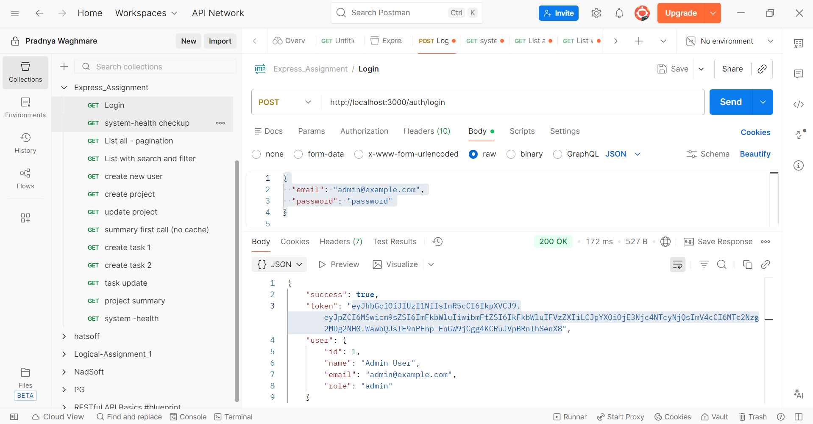
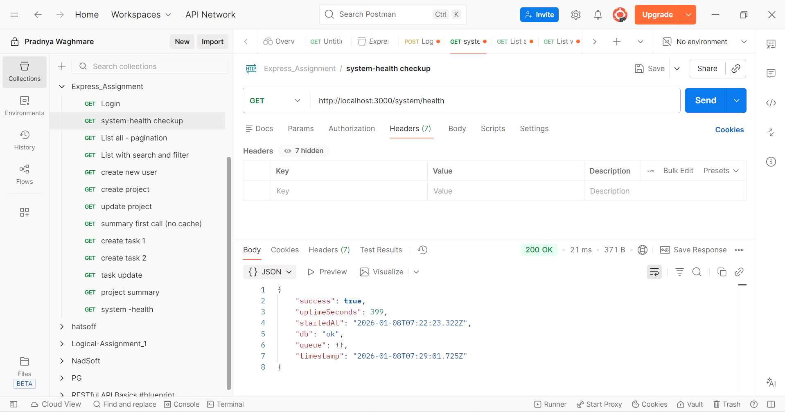
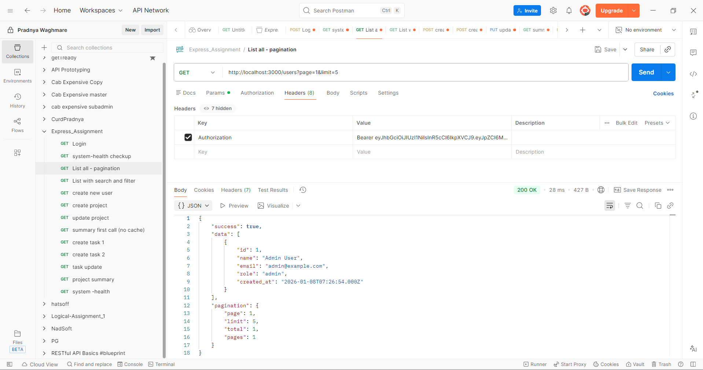
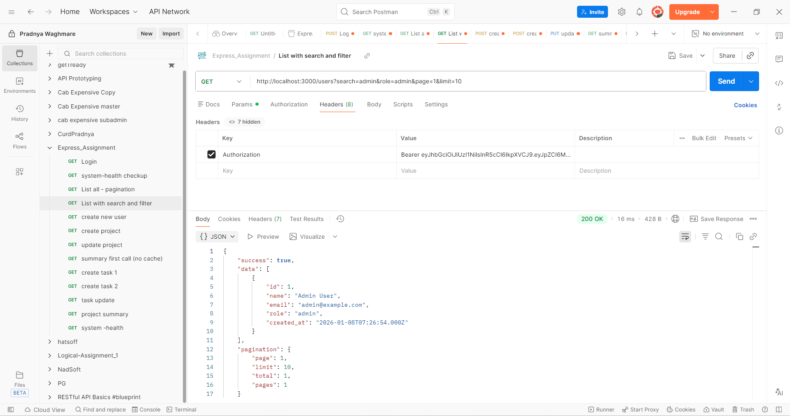
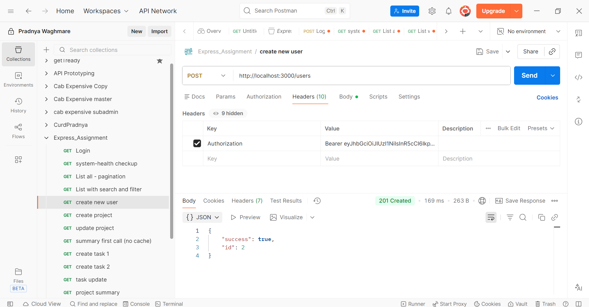
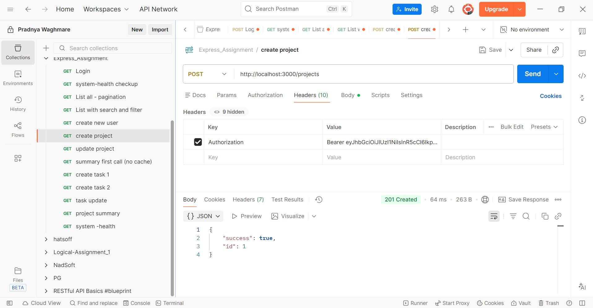
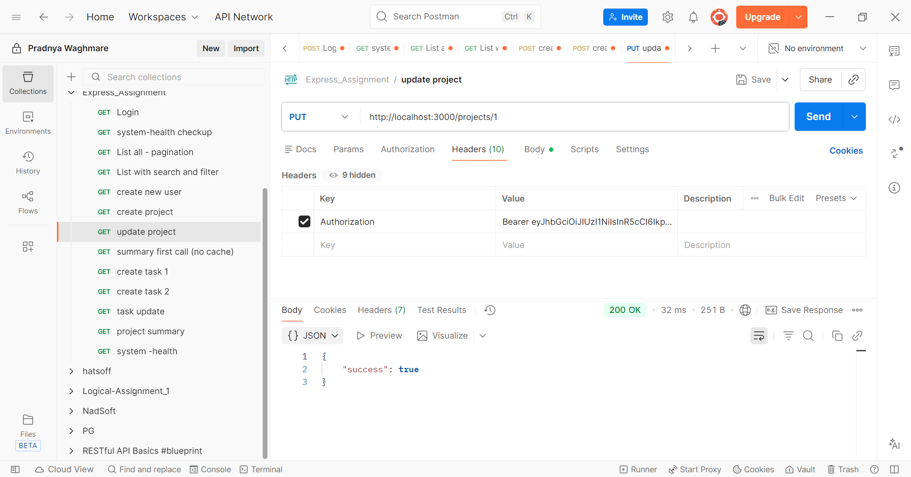
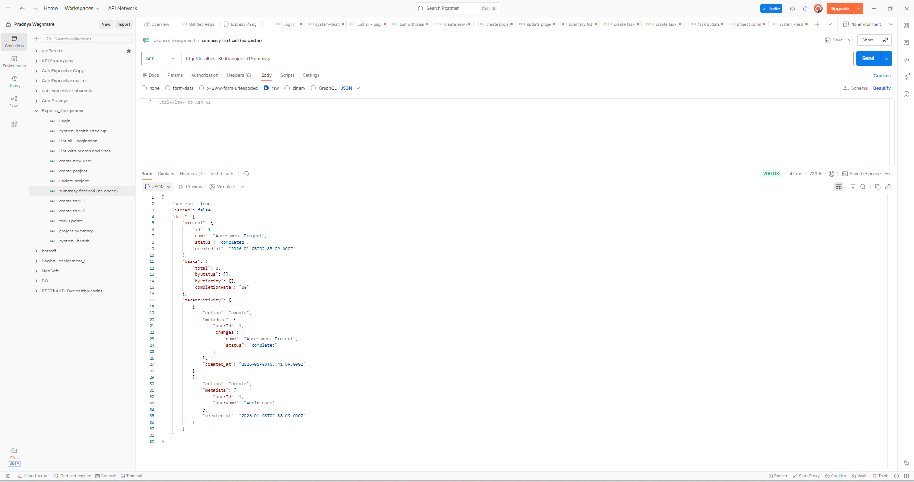
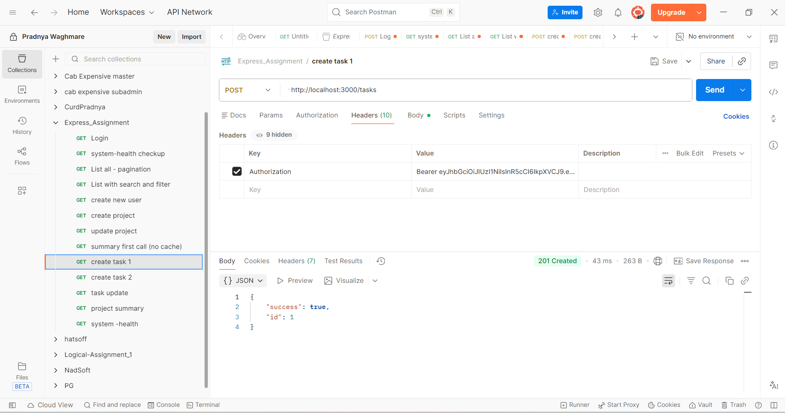
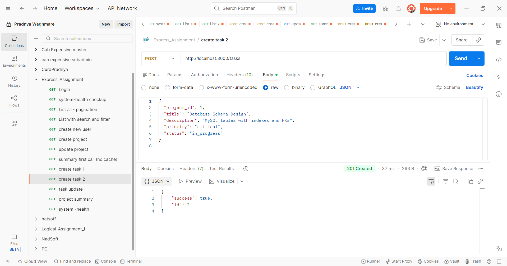
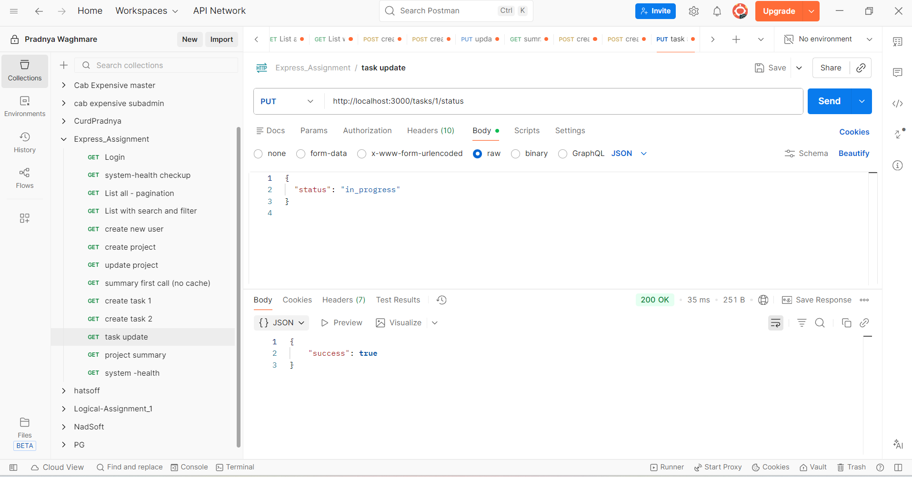
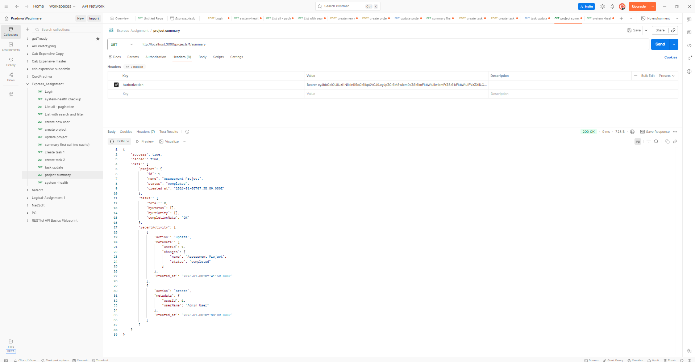
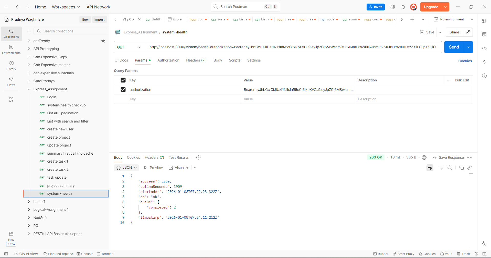

Test flow:

text
1. Login → Get token
2. List users
3. Create project → Get projectId
4. Create tasks → Update status
5. Summary → See cache + analytics
6. Health → Queue metrics
7. Error cases (401/400/404)
Sample login: admin@example.com / password

🏗️ Architecture Overview
text
┌─────────────────┐    ┌──────────────────┐
│     Client      │───▶│   Express Routes │
└─────────────────┘    │  Controllers     │
                       │  Validation      │
                       └──────────────────┘
                                 │
                    ┌────────────┼────────────┐
                    │            │            │
              ┌────────────┐ ┌────────────┐ ┌────────────┐
              │   Services │ │ MySQL Pool │ │   Cache    │
              │ Audit Logs │ │Transactions│ │  (Map)     │
              └────────────┘ └────────────┘ └────────────┘
                                 │
                    ┌────────────┼────────────┐
                    │            │            │
              ┌────────────┐ ┌────────────┐ ┌────────────┐
              │ activity_  │ │ job_queue  │ │ External   │
              │  logs      │ │ + Cron     │ │ Systems    │
              └────────────┘ └────────────┘ └────────────┘

## 📊 **Database Schema** (5 Tables)

| Table | Purpose | Key Features |
|-------|---------|--------------|
| `users` | User accounts | Roles, bcrypt hash, soft delete |
| `projects` | Project management | Status enum, audit trail |
| `tasks` | Task tracking | FK to projects, priority/status |
| `activity_logs` | Audit trail | Generic (`entity_type + entity_id`) |
| `job_queue` | Background jobs | Status + retry_count + locks |

**Full schema:** [`schema.sql`]

## 🎯 **Key Technical Decisions**

| Feature | Choice | Trade-off |
|---------|--------|-----------|
| **DB Access** | Raw MySQL | Full control vs ORM convenience |
| **Queue** | MySQL + Cron | ACID transactions vs Redis distributed |
| **Cache** | In-memory Map | Fastest vs Redis multi-server |
| **Security** | JWT + Roles | Stateless vs session storage |
| **Validation** | express-validator | Strict vs custom middleware |

## 🚀 **Production Checklist**

| Feature | Status | Implementation |
|---------|--------|----------------|
| Connection pooling | ✅ | mysql2/promise pool |
| Global error handling | ✅ | Express middleware |
| Input validation | ✅ | express-validator |
| SQL injection protection | ✅ | Parameterized queries |
| Data consistency | ✅ | MySQL transactions |
| Background processing | ✅ | Cron + job_queue |
| Performance caching | ✅ | In-memory analytics |
| Health monitoring | ✅ | `/system/health` endpoint |
| Audit logging | ✅ | activity_logs table |
| Role-based auth | ✅ | JWT + middleware |


🧪 Testing Strategy
bash
# Unit tests (add Jest)
npm test

# Integration (Postman)
npm run test:api

# Load test
npm run load-test
📈 Performance
Endpoint	Optimization
/users	Pagination + indexes
/projects/:id/summary	In-memory cache (60s TTL)
Job queue	Row locks (FOR UPDATE)
🔧 Development Scripts
json
{
  "scripts": {
    "dev": "nodemon src/server.js",
    "start": "node src/server.js",
    "db:reset": "mysql -u root -p < schema.sql"
  }
}
📧 Quick Demo Flow
text
1. npm install && npm run dev
2. mysql < schema.sql
3. POST /auth/login → admin@example.com/password
4. POST /projects → Create project
5. POST /tasks → Add tasks
6. GET /projects/1/summary → See analytics
7. Watch cron process job_queue (every 2min)
📚 Tech Stack
text
Backend: Node.js 20 + Express 4.18
Database: MySQL 8.0 (raw mysql2/promise)
Auth: JWT + bcrypt
Queue: Custom MySQL cron
Cache: In-memory Map
Validation: express-validator

🤝 Built For
Backend Developer Assessment - Full-Stack Operations Platform

⭐ Star if helpful!
📧 Questions? Open issue

</div> ```
